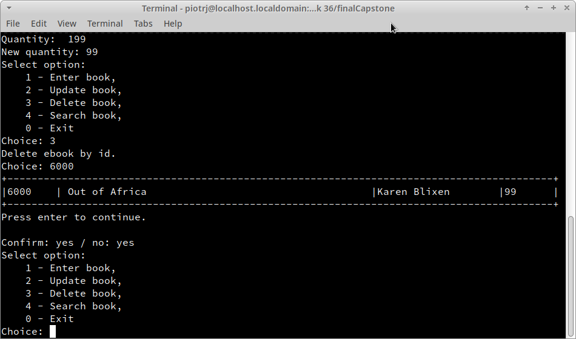

# FinalCapstone
## Description
This Python application developed using Python and SQLite3, provides a text simply-app for the bookstore clerk to manage the books inventory. They can add, update or delete a book from the database. They can view all books, or books with the lowest stock. They can also search books based on id, title or author. 
## Contents
### [Instalation and starting app](#instalation-and-starting-app)
### [Function](#function)
### [Usage](#usage)

## Instalation and starting app
The text-app requires database file to be in the same folder as the Python script called 'bookstore.py'. It does not require the database to be available during execution as the program creates the database, if it does not find one.  This application does not require any installations.
## Function
#### Enter book - add new book with unique ID( eg. barcode) into the book inventory,
#### Update book - update a book in the book inventory by unique ID,
#### Delete book -  delete a book from the book inventory by unique ID,
#### Search book - open new menu for searching tool,
#### Print all stock - print in friendly table all stock information(ID, title, author and quanity), 
* ##### Search book by ID - search for books from the book inventory by unique ID,
* ##### Search by title - search for book by title,
* ##### Search by author - search for books by author,
* ##### Search by quanity - open searching tool by quanity,
  * ##### request the number of books to be used as search criteria,
  * ##### based on the entered number, search for books by key:
  * ###### equal to entered number,
  * ###### less than entered number,
  * ###### equal to or less than entered number,
  * ###### equal or greater than entered number,
  * ###### more than entered number.
#### Exit - exit and save changes in database.
#### Back to main menu - each sub-menu has the function of returning to the upper menu, the main menu has the function of saving the changes made and exiting the application.
## Usage
After launching the application, the main menu appears.
From this menu we can start editing the database of books currently in the store.
# 

The 'add book' option (pressing the '1' key and enter) allows the user to enter a unique book number, title, author and the current quantity of that book in stock.

# 

After entering the information, an entry in the table containing the unique ID number, title, author and quantity is displayed. Confirmation by pressing enter followed by return to the main menu.

Selecting option number 2 - 'book update' - prompts for a unique book number. If the ID is entered correctly, the user is prompted to change each field for that item. Pressing 'enter' while editing an item will leave the field with its original value.

# 

Selecting option number 3 'deleting a book' causes the user to be asked for a unique book number. Entering a valid number displays the book record with the previously entered ID number. After pressing 'enter' you should answer whether the given book should be deleted from the database.

# 

Selecting option 4 'book search' gives you access to a menu where you can display the current entire content of the database containing all previously entered books (option number 1).
The next four options (from 2 to 5) allow you to search for a book / books by key: ID, title, author or current quantity in stock.

# 

The program is closed after selecting option number 0: 'exit' from the main menu.

Created and Maintained by Piotr Juszczak

